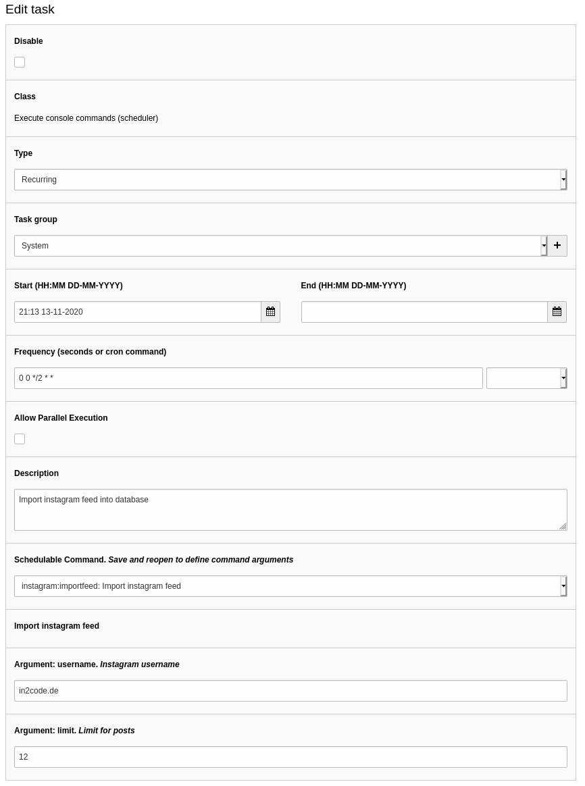
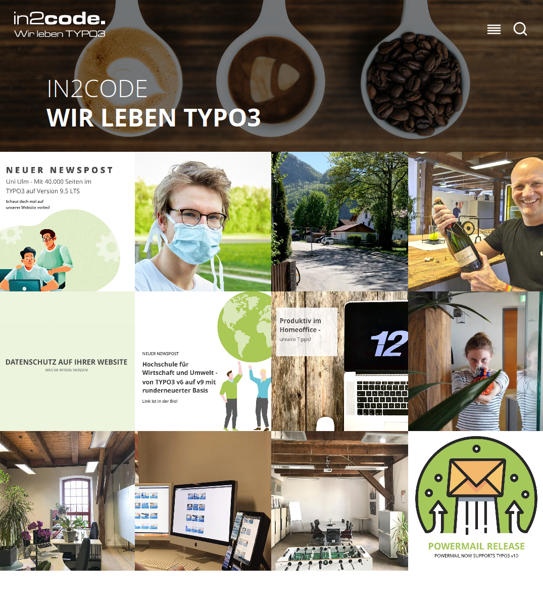
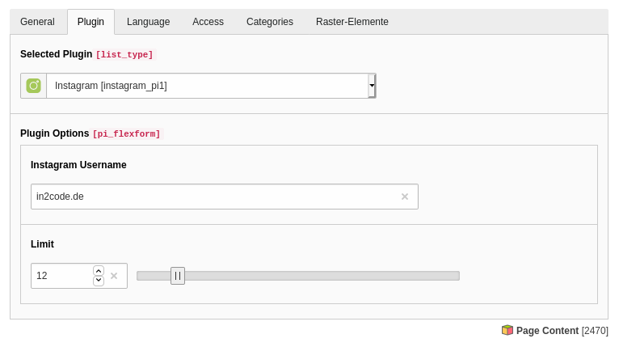
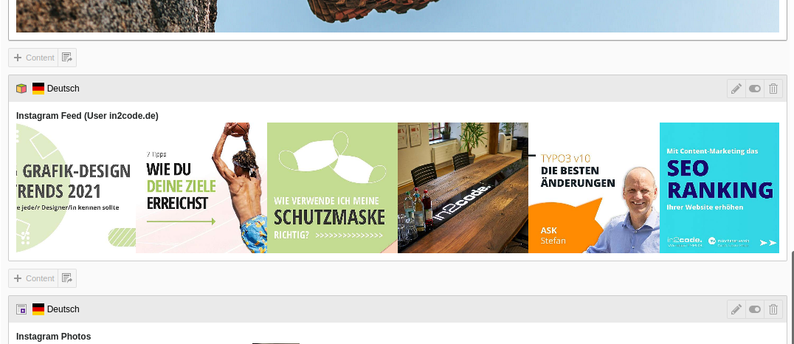

# Show a profile Instagram feed in TYPO3

## Introduction

In the past we did a lot of research to bypass the original Instagram API. Using the official interface is still pain. 
Now version 6 of this extension respects that Instagram updated their website (some days ago) again and cover it 
against image grapping. So, we decided now to use the official API in this extension to still deliver images on our
website.
Nevertheless we want to make the configuration as easy as possible even if there is some hard stuff for non-developers
now. Version 6 has some breaking changes because of the switch to the API now (see details below).


## Explanation

This extension is splitted into two parts. A scheduler where you can import an instagram feed into the database on
the one hand and on the other hand there is a plugin where you can show the feed on your page. The split gives us the
possibility to still show images even if the interface is broken and in addition there are no speed limitations with 
this kind of architecture.
Because of the guidelines of Instagram/Facebook the first step to use the API must be done by yourself and by hand. 
You have to add a facebook developer account and add a new "app". After that you have to get the token by yourself in a 
browser. Once you have did this, the token can be refreshed automatically. 
So you do not have to make the whole initialization again. See details
below.


## Installation

`composer require in2code/instagram`


## Configuration

### The facebook and instagram part

First of all, you should follow the official guidelines with step 1, 2 and 3 - see details at 
https://developers.facebook.com/docs/instagram-basic-display-api/getting-started

* Step 1: You need a facebook developer user - see https://developers.facebook.com/apps
* Step 2: Add a "facebook app" as described in the guidelines in step 1
* Step 3: Configure "Instagram Basic Display" in the guidelines in step 2
** Note: Simply use the homepage URL of your website for the "OAuth Redirect URIs" like `https://www.in2code.de/` (same for "Deauthorize Callback URL" and "Data Deletion Request Callback URL")
** Note2: Make some notes for your new "App ID", "App secret" and the "Redirect URI" - this will be needed later in the FlexForm
* Step 4: Add a instagram testuser as described in step 3 in the guidelines
* Step 5: Install the extension (if not yet done)
* Step 6: Add a Instagram plugin anywhere on your pages and open the edit view. Add "username", "App ID", "App secret" and "App return URL" and press "save"
* Step 7: Now you will see a button at the end of the FlexForm. Click on it and a new browserwindow is opened with the Instagram website. You have to login and accept the request. After that, you will be redirected to your homepage.
* Step 8: If you now reload the plugin, you will see a green message that tells you that you now have a valid token and how long the token is valid (no worry, ones you have created it, you can use a scheduler task to refresh it automatically)
* Step 9: Now, you have access to the API and you can add a new scheduler task and import images from the given user (You should frequently import the feed - e.g. every 30 minutes)
* Step 10: Once you have imported the images via scheduler, you can see the plugin output in the frontend with the given feed
* Step 11: Don't forget to add an additional scheduler task to frequently refresh the token validation after 30-50 days, because the long-live token in Instagram expires after 60 days.


### CLI commands

#### Import images

If you have access to the instagram API (look at the FlexForm in the plugin and watch for the green message), you can
import images via CLI or scheduler.

Import the latest 25 posts from `in2code.de`:

`./vendor/bin/typo3 instagram:importfeed in2code.de`

Import some posts and get notified if error happens via Email:

`./vendor/bin/typo3 instagram:importfeed in2code.de service@in2code.de`:

#### Refresh tokens

Because long-live-tokens are only valid for 60 days, you can automatically refresh them after some days - with:

`./vendor/bin/typo3 instagram:refreshtoken in2code.de`

#### Remove all tokens

If you change your instagram password, all generated tokens are not useable any more. You have to add new ones. But
first of all, you can delete them:

`./vendor/bin/typo3 instagram:removetokens`


### Scheduler

#### Import images

Add a new scheduler task of type `Execute console commands (scheduler)` and select `instagram:importfeed`. Now you can
add a frequency (e.g. `*/30 * * * *` for every 30 minutes), a instagram username and one (or more) email address if
error happens (and you want get notified).



| Field         | Description                                                                                                                               |
| ------------- | ----------------------------------------------------------------------------------------------------------------------------------------- |
| username      | Every task can import current posts from one user. If you want to show more feeds, you have to add more tasks.                            |
| receivers     | Optional: Get notified via email if a CURL error occurs (e.g. if instagram blocks your requests). Commaseparated email list is provided.  |

#### Refresh tokens

There is a new scheduler task, that can be used to automatically refresh Instagram tokens. We would do this after 30-50
days because a long-live token is valid for only 60 days.

Add a new scheduler task of type `Execute console commands (scheduler)` and select `instagram:refreshtoken`. Now you can
add a frequency (e.g. `0 5 */30 * ` for every 30 days at 5 am) and a instagram username.


### HTML output modification

Overwrite and modify the HTML output:

```
plugin {
    tx_instagram_pi1 {
        view {
            templateRootPaths {
                0 = EXT:instagram/Resources/Private/Templates/
            }
        }
    }
}
```


Example html:

```
<html xmlns:f="http://typo3.org/ns/TYPO3/CMS/Fluid/ViewHelpers"
	  xmlns:instagram="http://typo3.org/ns/In2code/Instagram/ViewHelpers"
	  data-namespace-typo3-fluid="true">

<div class="c-socialwall">
	<div class="c-socialwall">
		<f:for each="{feed.data}" as="image" iteration="iteration">
			<f:if condition="{iteration.cycle} <= {settings.limit}">
				<div class="c-socialwall__item c-socialwall__item--instagram">
					<f:link.external uri="{image.permalink}" title="Instagram profile {settings.username}" target="_blank" rel="noopener">

						<instagram:isLocalImageExisting id="{image.id}">
							<f:then>
								<picture>
									<source srcset="{f:uri.image(src:'/typo3temp/assets/tx_instagram/{image.id}.jpg', width:'500c', height:'500c', fileExtension: 'webp')}" type="image/webp">
									<source srcset="{f:uri.image(src:'/typo3temp/assets/tx_instagram/{image.id}.jpg', width:'500c', height:'500c', fileExtension: 'jpg')}" type="image/jpeg">

									 f:format.crop(maxCharacters: 120, append: ' ...')}"
										alt="{image.caption -> f:format.crop(maxCharacters: 120, append: ' ...')}"
										loading="lazy" />
								</picture>
							</f:then>
							<f:else>
								<f:comment>
									If image is not available on the local machine (for any reasons), load from instagram directly
								</f:comment>
								 f:format.crop(maxCharacters: 120, append: ' ...')}"
									alt="{image.caption -> f:format.crop(maxCharacters: 120, append: ' ...')}"
									width="500"
									height="500" />
							</f:else>
						</instagram:isLocalImageExisting>

						<p>{image.caption}</p>
					</f:link.external>
				</div>
			</f:if>
		</f:for>
	</div>
</div>

</html>
```


## Screenshots

### Example frontend output: 



### Plugin in backend:



### Plugin overview in backend page module:




## Technical corner

How to use the facebook/instagram API in general and how to test it?
See documentation: [ApiDocumentation](Documentation/InstagramApi.md)


## FAQ

### Q: The configuration in Instagram sounds complicated

A: Yes, we did a lot in the past to give you a gdpr proved and quick to install solution to show your instagram images
on your website. Now Instagram updated their websites again, to block "easy" image grabbing. At the moment we do not
see a simpler way then described above and also respect privacy for your visitors.

### Q: I clicked the button in the FlexForm and accepted but after that an error is shown

A: Instagram redirect you back to the configured url. If this is (e.g.) your startpage a PSR-15 middleware is listening
for GET params like `&code=foo`. This param is given from Instagram (not from us).

### Q: There is no (e.g. german) translation of the plugin

A: Yes, at the moment we focussed on english to speed up developing.

### Q: Token is only valid for 60 days. Do I have to refresh it manually?

A: No, if there is a valid token, you can refresh it (e.g.) after 30 days automatically via another scheduler task.

### Q: Error "OAuthException: Insufficient developer role Code: 400" comes up after clicking the button?

A: Take care that you are logged in into facebook with your developer account at the same time

### Q: How to add a GDPR-known button in frontend for the visitors?

A: No worries, this extension is absolutely GDPR-friendly. Text and images are stored anonymized on the server. No button needed for this.

### Q: Can I access to any instagram account?

A: No, because Instagram wants you to enable the access to the account, the owner has to accept this.

### Q: Is an approvement needed when building a Facebook app?

A: No, an approvement from Facebook is not needed.

### Q: Instagram password was changed - now I can't update the feed.

A: If you change the instagram password, all tokens are not valid any more. An error comes up like

```
{"error":{"message":"Error validating access token: The session has been invalidated because the user changed their pass (truncated...)
```

In this case you have to remove all tokens (see CLI section above) and create new ones from the scratch.


## Changelog

| Version    | Date       | State      | Description      |
| ---------- | ---------- | ---------- | ---------------- |
| 7.0.0      | 2022-02-21 | Task       | Support TYPO3 10 and 11 now |
| 6.2.1      | 2021-10-01 | Bugfix     | Prevent exception if image is a video |
| 6.2.0      | 2021-07-09 | Feature    | Add comand that allows you to delete all existing tokens |
| 6.1.3      | 2021-06-09 | Bugfix     | Use thumbnail images when storing local to allow video previews |
| 6.1.2      | 2021-06-09 | Bugfix     | Don't convert UserId to float value |
| 6.1.1      | 2021-06-09 | Task       | Harden middleware with code recognization |
| 6.1.0      | 2021-04-13 | Task       | Fix problem "Field id specified more than once. This is only possible before version 2.1" - because of a change of the instagram interface |
| 6.0.2      | 2021-03-17 | Task       | Add extension key to composer.json file, small documentation update |
| 6.0.1      | 2021-03-15 | Bugfix     | Change int to string field type for userId and appId to also handle large numbers |
| 6.0.0 !!!  | 2021-03-15 | Task       | Another rebuild now with the useage of the original Instagram API to grap images. See installation part in documentation what you have to do now. FlexForm, Scheduler and HTML-Templates have changed (this is a pitty, but have to be done). |
| 5.1.0      | 2021-01-21 | Feature    | Render images in listview in webp format. |
| 5.0.2      | 2020-12-23 | Bugfix     | Add a subject for error mails. |
| 5.0.1      | 2020-11-27 | Bugfix     | Enable caching for the plugin. |
| 5.0.0      | 2020-11-16 | Feature    | Pass a sessionid to instagram for blocked requests. Added a notification service for CURL errors. |
| 4.0.1      | 2020-11-14 | Bugfix     | Fix typo in ext_tables.sql |
| 4.0.0 !!!  | 2020-11-13 | Task       | Add a scheduler task to import feeds (without RSS feed now). A plugin allows you to push the images into the frontend |
| 3.0.0 !!!  | 2020-06-05 | Task       | Use RSS-feed now for a workarround that server request are blocked by instagram |
| 2.0.0      | 2020-05-08 | Task       | Store images locally now to improve privacy of your visitors. Use content element uid for building individual caches now |
| 1.1.0      | 2020-04-29 | Task       | Open links in new tabs, don't cache the view because of own caching framework usage  |
| 1.0.0      | 2020-04-29 | Task       | Initial release  |
